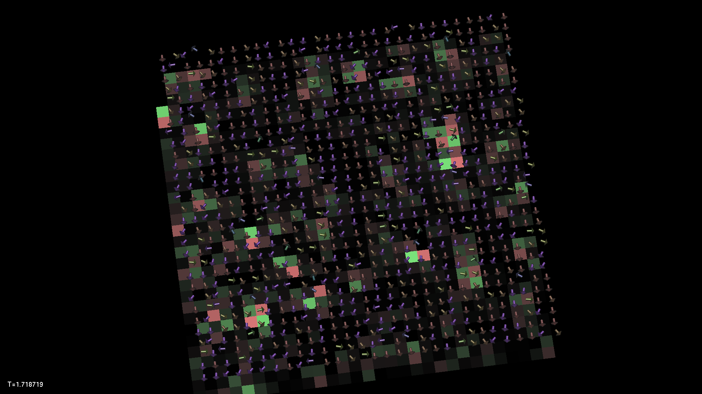
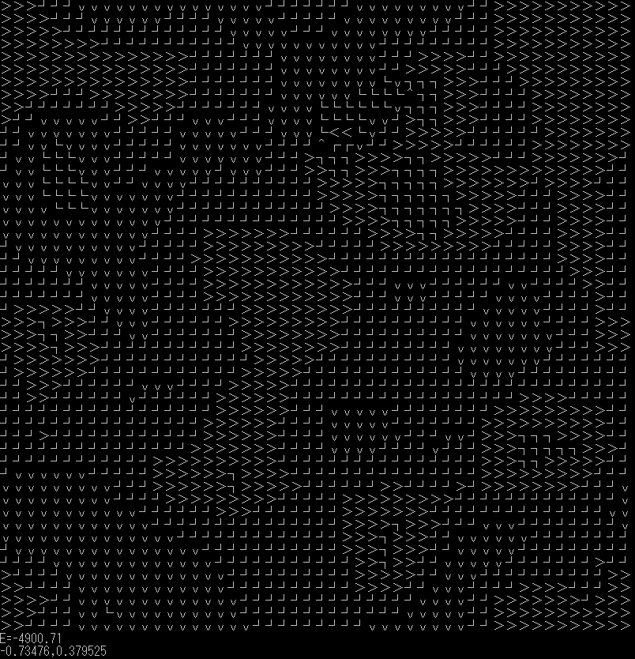

# xy
古典XY模型のプログラムです

XY模型における渦の可視化です。2016年度のノーベル物理学賞を受賞して話題になりました。+で温度があがり-で温度が下がります。

OpenGLでカメラが回せる奴

CUIで完結した軽量な奴

OpenCVでキャプチャした動画はtwitterにあります。
https://twitter.com/iKodack/status/783516318507171840
